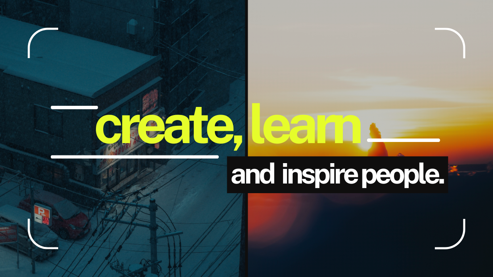

  <h1>Hi, I'm Aryan Pandey 👋</h1>
  

    <code>Full Stack Developer</code> • 
    <code>SaaS Builder</code> • 
    <code>Tech & Business</code> • 
    <code>Always Learning</code>
  

  
I design and build full-stack web applications and SaaS platforms with a focus on clean architecture, scalability, and long-term impact.

  

 

  

 

<h3 align="center">Tech Stack</h3>

   
   
  

 

<h3 align="center">Connect</h3>

&nbsp;&nbsp;&nbsp;&nbsp;&nbsp;

 

  
<em>"I build. I ship. I improve."</em>

  

